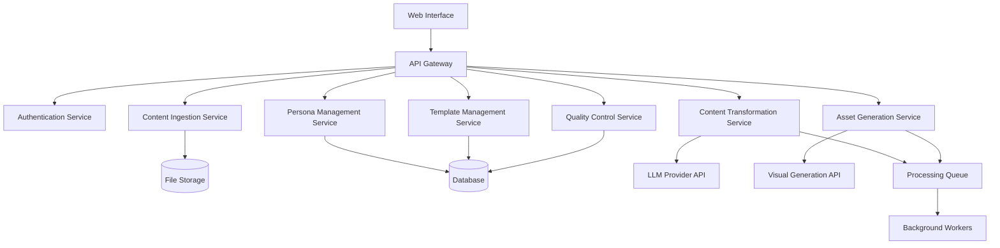

# Design Document - Drishti Transformer

## Overview

The Drishti Transformer is a sophisticated content transformation platform that leverages modern AI technologies to automatically adapt complex technical content for different audience personas. The system combines document parsing, natural language processing, persona-based content generation, and automated visual asset creation to solve the "one-size-fits-none" problem in digital content distribution.

Based on research findings, the system will utilize proven approaches including persona-specific prompting (which can boost output quality to 94% compared to 60% for generic approaches), modern PDF parsing libraries like pdfplumber and PyPDF, and AI-powered visual generation tools that can reduce design costs by up to 60% while accelerating production by 2-5x.

## Architecture

The system follows a modular, microservices-inspired architecture with clear separation of concerns:



### Core Architecture Principles

1. **Separation of Concerns**: Each service handles a specific domain responsibility
2. **Asynchronous Processing**: Long-running transformations use background job queues
3. **Scalable Design**: Services can be scaled independently based on demand
4. **Extensible Framework**: New output formats and persona types can be added without core changes
5. **Fault Tolerance**: Graceful degradation when external services are unavailable

## Components and Interfaces

### Content Ingestion Service

**Purpose**: Parse and extract structured content from various input formats

**Key Components**:
- **PDF Parser**: Uses pdfplumber for complex layouts, PyPDF for simple text extraction
- **Document Processor**: Handles Word documents via python-docx
- **Markdown Parser**: Preserves structure using markdown library
- **Text Analyzer**: Extracts semantic structure and key concepts
- **Content Validator**: Ensures extracted content meets quality thresholds

**Interface**:
```typescript
interface ContentIngestionService {
  parseDocument(file: File, options: ParseOptions): Promise<ParsedContent>
  validateContent(content: ParsedContent): ValidationResult
  extractMetadata(content: ParsedContent): ContentMetadata
}

interface ParsedContent {
  id: string
  title: string
  sections: ContentSection[]
  metadata: ContentMetadata
  rawText: string
  structure: DocumentStructure
}
```

### Persona Management Service

**Purpose**: Define, store, and manage audience personas with their characteristics

**Key Components**:
- **Persona Repository**: CRUD operations for persona definitions
- **Persona Validator**: Ensures persona completeness and consistency
- **Persona Matcher**: Suggests relevant personas for content types
- **Template Mapper**: Links personas to appropriate output templates

**Interface**:
```typescript
interface PersonaManagementService {
  createPersona(definition: PersonaDefinition): Promise<Persona>
  updatePersona(id: string, updates: Partial<PersonaDefinition>): Promise<Persona>
  getPersona(id: string): Promise<Persona>
  searchPersonas(criteria: PersonaSearchCriteria): Promise<Persona[]>
  deletePersona(id: string): Promise<void>
}

interface PersonaDefinition {
  name: string
  expertiseLevel: 'beginner' | 'intermediate' | 'expert'
  interests: string[]
  communicationStyle: 'formal' | 'casual' | 'technical' | 'conversational'
  preferredFormats: OutputFormat[]
  contextualNeeds: string[]
  demographicInfo?: DemographicInfo
}
```

### Content Transformation Service

**Purpose**: Core AI-powered content adaptation engine

**Key Components**:
- **LLM Orchestrator**: Manages interactions with language model APIs
- **Prompt Generator**: Creates persona-specific prompts based on research findings
- **Content Analyzer**: Identifies key concepts and adaptation points
- **Style Adapter**: Adjusts language complexity and tone
- **Fact Checker**: Validates factual accuracy across transformations

**Interface**:
```typescript
interface ContentTransformationService {
  transformContent(
    content: ParsedContent, 
    persona: Persona, 
    outputFormat: OutputFormat
  ): Promise<TransformedContent>
  
  generatePersonaPrompt(persona: Persona, content: ParsedContent): string
  validateTransformation(original: ParsedContent, transformed: TransformedContent): ValidationResult
}

interface TransformedContent {
  id: string
  originalContentId: string
  personaId: string
  format: OutputFormat
  content: string
  metadata: TransformationMetadata
  qualityScore: number
}
```

### Asset Generation Service

**Purpose**: Create visual assets, charts, and infographics

**Key Components**:
- **Chart Generator**: Creates data visualizations from numerical content
- **Infographic Builder**: Combines text and visuals into cohesive layouts
- **Image Generator**: Creates supporting images and illustrations
- **Style Coordinator**: Ensures visual consistency across assets
- **Format Optimizer**: Adapts assets for different output platforms

**Interface**:
```typescript
interface AssetGenerationService {
  generateChart(data: ChartData, style: ChartStyle): Promise<GeneratedAsset>
  createInfographic(content: InfographicContent, template: Template): Promise<GeneratedAsset>
  generateSupportingImages(context: ImageContext): Promise<GeneratedAsset[]>
  optimizeForPlatform(asset: GeneratedAsset, platform: Platform): Promise<GeneratedAsset>
}

interface GeneratedAsset {
  id: string
  type: 'chart' | 'infographic' | 'image' | 'diagram'
  format: 'png' | 'svg' | 'pdf'
  url: string
  metadata: AssetMetadata
  dimensions: { width: number; height: number }
}
```

### Template Management Service

**Purpose**: Manage output format templates and styling

**Key Components**:
- **Template Repository**: Store and version template definitions
- **Style Engine**: Apply consistent styling across outputs
- **Layout Manager**: Handle responsive and adaptive layouts
- **Brand Manager**: Maintain brand consistency across transformations

**Interface**:
```typescript
interface TemplateManagementService {
  getTemplate(format: OutputFormat, persona?: Persona): Promise<Template>
  createTemplate(definition: TemplateDefinition): Promise<Template>
  updateTemplate(id: string, updates: Partial<TemplateDefinition>): Promise<Template>
  applyTemplate(content: TransformedContent, template: Template): Promise<FormattedContent>
}

interface Template {
  id: string
  name: string
  format: OutputFormat
  styleRules: StyleRule[]
  layoutConfig: LayoutConfig
  brandingElements: BrandingElement[]
}
```

### Quality Control Service

**Purpose**: Review, validate, and manage content quality

**Key Components**:
- **Quality Analyzer**: Automated quality assessment
- **Review Manager**: Human review workflow coordination
- **Version Controller**: Track content revisions and approvals
- **Export Manager**: Handle final content packaging and delivery

**Interface**:
```typescript
interface QualityControlService {
  analyzeQuality(content: TransformedContent): Promise<QualityReport>
  submitForReview(content: TransformedContent): Promise<ReviewSession>
  approveContent(reviewId: string, feedback?: string): Promise<ApprovedContent>
  exportContent(contentId: string, format: ExportFormat): Promise<ExportResult>
}

interface QualityReport {
  overallScore: number
  factualAccuracy: number
  styleConsistency: number
  personaAlignment: number
  issues: QualityIssue[]
  suggestions: string[]
}
```

## Data Models

### Core Entities

```typescript
// Content Models
interface ParsedContent {
  id: string
  title: string
  originalFileName: string
  fileType: string
  uploadedAt: Date
  sections: ContentSection[]
  metadata: ContentMetadata
  processingStatus: 'pending' | 'processing' | 'completed' | 'failed'
}

interface ContentSection {
  id: string
  type: 'heading' | 'paragraph' | 'list' | 'table' | 'image' | 'code'
  content: string
  level?: number // for headings
  metadata?: Record<string, any>
}

interface ContentMetadata {
  wordCount: number
  readingLevel: string
  keyTopics: string[]
  technicalTerms: string[]
  dataPoints: DataPoint[]
  estimatedReadingTime: number
}

// Persona Models
interface Persona {
  id: string
  name: string
  description: string
  expertiseLevel: ExpertiseLevel
  interests: string[]
  communicationStyle: CommunicationStyle
  preferredFormats: OutputFormat[]
  contextualNeeds: string[]
  createdAt: Date
  updatedAt: Date
}

type ExpertiseLevel = 'beginner' | 'intermediate' | 'expert' | 'mixed'
type CommunicationStyle = 'formal' | 'casual' | 'technical' | 'conversational' | 'academic'
type OutputFormat = 'slides' | 'social_thread' | 'summary' | 'blog_post' | 'infographic' | 'report'

// Transformation Models
interface TransformationJob {
  id: string
  contentId: string
  personaId: string
  outputFormat: OutputFormat
  templateId?: string
  status: JobStatus
  progress: number
  startedAt: Date
  completedAt?: Date
  result?: TransformedContent
  error?: string
}

type JobStatus = 'queued' | 'processing' | 'completed' | 'failed' | 'cancelled'

// Asset Models
interface GeneratedAsset {
  id: string
  contentId: string
  type: AssetType
  format: AssetFormat
  url: string
  thumbnailUrl?: string
  metadata: AssetMetadata
  createdAt: Date
}

type AssetType = 'chart' | 'infographic' | 'image' | 'diagram' | 'icon'
type AssetFormat = 'png' | 'svg' | 'pdf' | 'jpg' | 'webp'

// Quality Models
interface QualityReport {
  id: string
  contentId: string
  overallScore: number
  metrics: QualityMetric[]
  issues: QualityIssue[]
  suggestions: string[]
  reviewedAt: Date
  reviewerId?: string
}

interface QualityMetric {
  name: string
  score: number
  weight: number
  description: string
}

interface QualityIssue {
  type: 'factual' | 'style' | 'formatting' | 'persona_mismatch'
  severity: 'low' | 'medium' | 'high'
  description: string
  location?: string
  suggestion?: string
}
```

### Database Schema Considerations

**Primary Database**: PostgreSQL for ACID compliance and complex queries
**File Storage**: AWS S3 or compatible object storage for documents and assets
**Cache Layer**: Redis for session management and frequently accessed data
**Search Index**: Elasticsearch for content search and persona matching

## Correctness Properties

*A property is a characteristic or behavior that should hold true across all valid executions of a system—essentially, a formal statement about what the system should do. Properties serve as the bridge between human-readable specifications and machine-verifiable correctness guarantees.*

Before defining the correctness properties, I need to analyze the acceptance criteria from the requirements document to determine which ones are testable as properties.

### Content Processing Properties

**Property 1: Universal File Processing**
*For any* supported file format (PDF, Word, Markdown, Plain Text), the Ingestion_System should successfully parse the file and produce a structured ParsedContent object with preserved formatting where applicable
**Validates: Requirements 1.1, 1.2, 1.3, 1.4**

**Property 2: Content Structure Preservation**
*For any* input document with hierarchical structure (headings, sections, lists), the parsed output should maintain the same structural relationships in the internal representation
**Validates: Requirements 1.2, 1.3**

**Property 3: Error Handling Consistency**
*For any* system operation that fails, the system should return a structured error response with specific details and actionable suggestions for remediation
**Validates: Requirements 1.5, 1.6, 3.6, 4.6, 5.5, 6.6**

### Persona Management Properties

**Property 4: Persona Data Integrity**
*For any* valid persona definition, creating and then retrieving the persona should return an equivalent persona object with all specified attributes intact
**Validates: Requirements 2.1, 2.5**

**Property 5: Persona Validation Consistency**
*For any* persona definition missing required fields, the validation process should reject the persona and identify all missing required fields
**Validates: Requirements 2.2**

**Property 6: Persona Lifecycle Management**
*For any* persona modification or deletion operation, the system should preserve historical transformation data while updating the persona state appropriately
**Validates: Requirements 2.3, 2.4**

**Property 7: Persona Search Accuracy**
*For any* search query and persona database, all returned results should match the search criteria based on name or attribute content
**Validates: Requirements 2.6**

### Content Transformation Properties

**Property 8: Transformation Completeness**
*For any* valid content and persona combination, the transformation process should analyze the source content and produce output adapted for the specified persona's characteristics
**Validates: Requirements 3.1, 3.2, 3.4**

**Property 9: Factual Accuracy Preservation**
*For any* content transformation, all factual claims and numerical data in the original content should be preserved accurately in the transformed output, regardless of style changes
**Validates: Requirements 3.3**

**Property 10: Output Format Compliance**
*For any* transformation request specifying an output format, the generated content should conform to the structural requirements of that format
**Validates: Requirements 3.5, 4.1, 4.2, 4.3, 4.4, 4.5**

### Asset Generation Properties

**Property 11: Data Visualization Consistency**
*For any* content containing numerical data, the Asset_Generator should create appropriate visual representations (charts, graphs) that accurately reflect the underlying data
**Validates: Requirements 5.1**

**Property 12: Visual Asset Coherence**
*For any* single transformation generating multiple visual assets, all assets should maintain consistent styling, color schemes, and visual hierarchy
**Validates: Requirements 5.2, 5.3, 5.6**

**Property 13: Platform Optimization Accuracy**
*For any* social media asset generation request, the output should meet the dimensional and format specifications of the target platform
**Validates: Requirements 5.4**

### Template System Properties

**Property 14: Template Application Consistency**
*For any* content and template combination, applying the template should result in output that conforms to all specified formatting rules and style guidelines
**Validates: Requirements 6.1, 6.3**

**Property 15: Template Customization Persistence**
*For any* template modification, saving the changes and then retrieving the template should return the modified version with all customizations intact
**Validates: Requirements 6.2**

**Property 16: Template Backward Compatibility**
*For any* existing transformation using a template, updating the template should not break the ability to regenerate or export the existing transformation
**Validates: Requirements 6.4**

### Quality Control Properties

**Property 17: Review Workflow Completeness**
*For any* completed transformation, the Quality_Controller should present the content for review with clear change indicators and provide mechanisms for approval or revision requests
**Validates: Requirements 7.1, 7.2**

**Property 18: Quality Issue Detection**
*For any* content with detectable quality issues (factual inconsistencies, formatting problems, persona mismatches), the system should flag these issues and provide specific guidance for resolution
**Validates: Requirements 7.4**

**Property 19: Version Control Integrity**
*For any* content revision sequence, the system should maintain a complete history allowing reconstruction of any previous version
**Validates: Requirements 7.5**

**Property 20: Export Completeness**
*For any* approved content export, the output should include all associated assets, formatting, and metadata required for standalone use
**Validates: Requirements 7.6**

### System Reliability Properties

**Property 21: Error Logging Completeness**
*For any* system error or exception, detailed error information should be logged with sufficient context for troubleshooting and debugging
**Validates: Requirements 8.3**

**Property 22: Progress Tracking Accuracy**
*For any* long-running transformation operation, the system should provide progress indicators that accurately reflect the completion percentage and estimated time remaining
**Validates: Requirements 8.5**

## Error Handling

The system implements comprehensive error handling across all components with consistent patterns:

### Error Classification

1. **Input Validation Errors**: Malformed files, invalid persona definitions, missing required fields
2. **Processing Errors**: AI service failures, parsing errors, transformation failures
3. **Resource Errors**: File size limits, storage failures, quota exceeded
4. **System Errors**: Database connectivity, external service unavailability, internal exceptions

### Error Response Format

All errors follow a consistent structure:
```typescript
interface ErrorResponse {
  error: {
    code: string
    message: string
    details?: Record<string, any>
    suggestions?: string[]
    retryable: boolean
    timestamp: Date
  }
}
```

### Fallback Strategies

1. **Asset Generation Failures**: Provide text-based alternatives when visual generation fails
2. **Template Application Failures**: Use default formatting when custom templates fail
3. **AI Service Unavailability**: Queue requests for retry when external services are down
4. **Partial Processing**: Save intermediate results to allow resumption of failed operations

### Error Recovery

- **Automatic Retry**: Transient failures are automatically retried with exponential backoff
- **Graceful Degradation**: System continues operating with reduced functionality when non-critical services fail
- **User Notification**: Clear communication about errors and available alternatives
- **Data Preservation**: No data loss during error conditions; all work is preserved

## Testing Strategy

The Drishti Transformer employs a comprehensive dual testing approach combining unit tests for specific scenarios with property-based tests for universal correctness validation.

### Property-Based Testing

**Framework**: We will use Hypothesis for Python-based services and fast-check for TypeScript/JavaScript components, configured to run a minimum of 100 iterations per property test to ensure comprehensive input coverage.

**Property Test Implementation**:
- Each correctness property from the design document will be implemented as a separate property-based test
- Tests will be tagged with the format: **Feature: echo-chamber-breaker, Property {number}: {property_text}**
- Property tests will generate diverse inputs to validate universal behaviors across the system
- Focus areas include content parsing, persona-based transformations, template applications, and asset generation

**Key Property Test Categories**:
1. **Content Processing**: Generate various file formats and structures to test parsing consistency
2. **Persona Transformations**: Create diverse persona-content combinations to validate adaptation accuracy
3. **Template Applications**: Test template consistency across different content types and formats
4. **Asset Generation**: Validate visual asset creation with various data types and styling requirements
5. **Error Handling**: Generate edge cases and invalid inputs to test error response consistency

### Unit Testing

**Complementary Coverage**: Unit tests focus on specific examples, edge cases, and integration points that property tests might not naturally discover.

**Unit Test Focus Areas**:
- **Specific Format Handling**: Test known challenging document formats (complex PDFs, nested Word documents)
- **Integration Points**: Verify correct interaction between services and external APIs
- **Edge Cases**: Handle boundary conditions like empty files, maximum size limits, special characters
- **Error Conditions**: Test specific error scenarios and recovery mechanisms
- **Performance Validation**: Ensure acceptable response times for standard operations

**Test Organization**:
- Service-level unit tests for each major component
- Integration tests for cross-service workflows
- End-to-end tests for complete transformation pipelines
- Mock external dependencies (LLM APIs, asset generation services) for reliable testing

### Testing Infrastructure

**Continuous Integration**: All tests run automatically on code changes with parallel execution for faster feedback
**Test Data Management**: Curated test datasets including various document types, persona definitions, and expected outputs
**Performance Monitoring**: Automated performance regression detection through benchmark tests
**Quality Gates**: Minimum test coverage thresholds and property test success rates required for deployment

The combination of property-based and unit testing ensures both broad correctness validation and specific scenario coverage, providing confidence in the system's reliability and accuracy across diverse use cases.